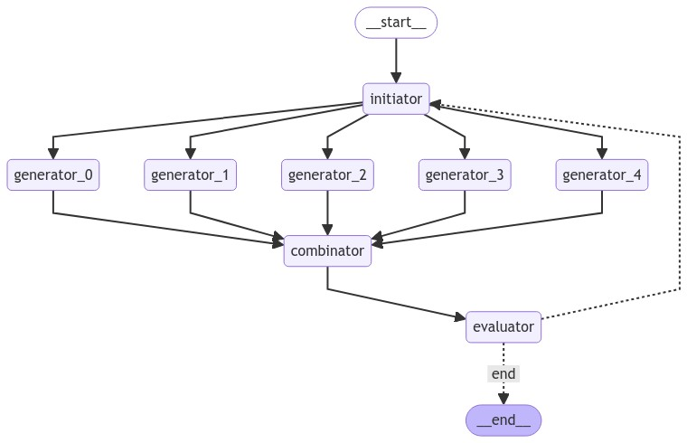

# ARC-AGI-solution
 
Trying out different ways of “thinking”, using LLMs as my intuition guide for the search process. The goal is to solve ARC-AGI but we'll see.

## Current version

The code is still in the early stages but the idea is to have a simple and fast way to test different approaches and see what works. 

The code is not optimized for performance, it's optimized for flexibility and ease of use. Mostly using langchain and langgraph for multiagent architecture.
So far it's as simple as:
- **initiator model**: looks at the problem and creates the prompt for the pattern generators nodes
- **pattern generators ("intuition")**: multiple LLMs running in parallel, identifying patterns and rules in the task
- **pattern combinator**: takes those patterns, combine them and generate a solution for the test
- **evaluator**: checks if the solution is correct, scores the output and gives feedback to the generators 

 


## Requirements:
- set up an .env file with your OPENAI_API_KEY
- install ollama and get llama3.1
```bash
pip install -r requirements.txt
```

## Usage
```bash
python main.py  --num_generators 10 --num_iterations 5 --initiator_model gpt-4o --combinator_model gpt-4o --evaluator_model gpt-4o --task_id 0520fde7
```

## Next steps and ideas

- [ ] Make the prompt engineering system more robust and find more effective ways to generate and combine patterns
    - [ ] Ensure the patterns are non-trivial
    - [ ] Make the testing of examples (input -> output) more effective and reject patterns that do not meet the criteria
- [ ] Allow the model to (optionally) create code and execute it to test the solutions (instead of outputting the answer directly)

Check out the project https://github.com/users/lucaspecina/projects/1/views/1 for new developments and bug fixes.

## Contributing

Ideas and pull requests are welcome. For major changes, please open an issue first to discuss what you would like to change.
